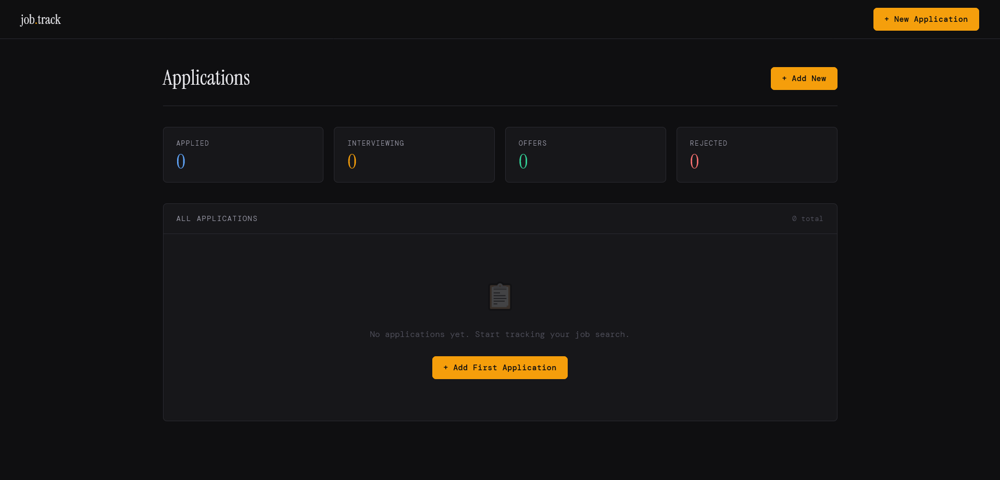

# 🎯 Job.Track - Job Application CRM

A streamlined, modern Job Application Tracker built with Django. 

This application acts as a personal CRM for the job hunt. It allows the user to log applications, track their status, store interview notes, and view real-time statistics of their job search pipeline.


## ✨ Features

* **Real-time Dashboard:** View all your job applications in a clean, easily readable table.
* **Pipeline Statistics:** Automatically calculates and displays how many applications are in the *Applied*, *Interviewing*, *Offer*, and *Rejected* stages.
* **Status Badges:** Color-coded UI elements to quickly gauge where you stand with each company.
* **CRUD Functionality:** Full Create, Read, and Update capabilities for managing application data.
* **Custom Admin Panel:** Fully customized Django Admin interface with search filtering and custom list displays.

## 🛠️ Built With

* **Backend:** Python, Django 6.0
* **Database:** SQLite (Default Django configuration)
* **Frontend:** HTML5, Custom CSS3, Google Fonts (*DM Sans, DM Mono, Instrument Serif*)
* **Architecture:** Django Class-Based Views (CBVs) and Model-Template-View (MTV) pattern.

## 🚀 How to Run Locally

If you'd like to run this project on your own machine, follow these steps:

**1. Clone the repository:**
```bash
git clone https://github.com/YOUR-USERNAME/job-tracker.git
cd job-tracker
```

2. Create and activate a virtual environment:
```bash

# Windows
python -m venv venv
venv\Scripts\activate

# macOS/Linux
python3 -m venv venv
source venv/bin/activate
```

3. Install dependencies:
```bash

pip install django
```

4. Apply database migrations:
```bash

python manage.py migrate
```

5. Create an admin user (Optional but recommended):
```bash

python manage.py createsuperuser
```

6. Start the development server:
```bash

python manage.py runserver
```

Visit http://127.0.0.1:8000 in your browser to view the application! To view the customized admin panel, visit http://127.0.0.1:8000/admin.